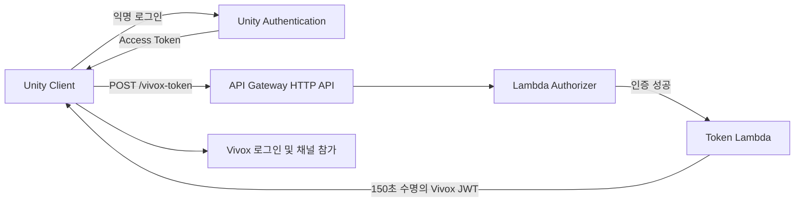

# Session and Voice

`SteamLobby.cs`는 여러 팀원이 함께 수정한 공동 작업 파일이며, 제가 구현하거나 주요하게 기여한 Steam 로비 생성·초대 수락·클라이언트 접속과 세션 종료 관련 필드·메서드를 정리했습니다.

이 폴더는 Steam/FishNet 세션의 수명주기와 AWS Lambda 토큰을 이용한 Vivox 음성 채팅 연결을 보여줍니다.

## 처리 흐름

`Steam 로비 생성·초대 수락 → 로비 소유자 판별 → FishNet 호스트·클라이언트 연결 → Lambda 토큰 발급 → Vivox 로그인·채널 참가 → 참가자 상태 동기화 → 음량·음소거 제어 → 채널·네트워크·로비 순차 종료`

## UGS 인증을 결합한 서버리스 토큰 발급 프로토타입

Vivox 토큰 서명 비밀키는 Lambda 환경변수에서 관리하고, API Gateway와 AWS Lambda를 토큰 발급 경계로 구성했습니다.

Lambda Authorizer는 UGS Access Token의 서명, issuer와 만료 시간을 공개키로 검증합니다. 인증을 통과한 요청만 토큰 발급 Lambda로 전달되며, Lambda는 환경변수에 보관한 Vivox 서명키로 짧은 수명의 JWT를 생성합니다. Unity에서는 `IVivoxTokenProvider` 구현체인 `LambdaTokenProvider`가 이 과정을 Vivox SDK의 로그인·채널 참가 흐름에 연결합니다.

`x-game-key`는 클라이언트에 포함되는 값이므로 사용자 인증 수단으로 취급하지 않습니다. 운영 중 긴급 차단과 기본적인 사용량 제어를 위한 보조 값으로만 사용하고, 실제 요청 인증은 UGS Access Token 검증이 담당합니다.

이 구조를 통해 다음 책임을 분리했습니다.

- Vivox 서명키를 클라이언트 코드와 설정 에셋에서 분리
- UGS 사용자 인증과 Vivox 토큰 발급을 API Gateway 경계에서 연결
- 짧은 수명의 토큰으로 유출 시 사용 가능 시간을 제한
- 별도 전용 인증 서버를 상시 운영하지 않고 필요한 시점에만 실행되는 서버리스 구성
- Unity 측 토큰 공급자를 교체 가능한 인터페이스로 분리

현재 구성은 3인 협동 게임에서 UGS 인증과 Vivox 토큰 발급을 연결하기 위해 구현한 서버리스 프로토타입입니다.

## 파일별 설명

### [`SteamLobby.cs`](SteamLobby.cs)

Steam 로비 생성과 초대 수락, 로비 소유자 판별, FishNet 호스트·클라이언트 연결, 글로벌 로비 씬 로드, Vivox·FishNet·Steam의 순차 종료를 처리합니다.

### [`ConnectionLimiter.cs`](ConnectionLimiter.cs)

로비에서는 최대 인원을 검사하고, 게임 시작 이후에는 당시 접속 인원으로 세션을 잠급니다. 서버 종료와 메뉴·로비 씬 복귀 시 잠금 상태를 초기화합니다.

### [`LambdaTokenProvider.cs`](LambdaTokenProvider.cs)

UGS PlayerId와 Vivox action·SIP URI를 Lambda 요청으로 구성하고, API Gateway에서 반환한 JWT를 Vivox SDK에 제공합니다. endpoint와 사용량 제어용 `x-game-key` 값은 설정 에셋에서 주입합니다.

### [`VivoxBootstrap.cs`](VivoxBootstrap.cs)

Unity Services 초기화 후 UGS 익명 인증을 확정하고, Lambda 토큰 공급자와 Vivox SDK를 초기화한 뒤 로그인과 포지셔널 채널 참가를 처리합니다. 준비 요청을 직렬화해 초기화와 로그인의 중복 실행을 방지하고 로컬 위치 갱신기를 연결합니다.

### [`VivoxPositionUpdater.cs`](VivoxPositionUpdater.cs)

로컬 플레이어만 일정 주기로 Vivox에 3D 위치를 전달합니다. 청취 위치를 카메라와 캐릭터 사이에서 전환할 수 있습니다.

### [`PlayerVoiceLink.cs`](PlayerVoiceLink.cs)

네트워크 플레이어의 UGS PlayerId와 역할을 FishNet `SyncVar`로 동기화하고, 해당 정보를 아바타와 로컬 음성 상태에 연결합니다.

### [`VoiceChatController.cs`](VoiceChatController.cs)

참가자별 음량·음소거·역할 보정과 로컬 마이크 상태를 관리합니다. 값이 바뀐 경우에만 Vivox 참가자 볼륨을 갱신합니다.

### [`PlayerVoiceChatList.cs`](PlayerVoiceChatList.cs) · [`PlayerVoiceChatControlPanel.cs`](PlayerVoiceChatControlPanel.cs)

현재 네트워크 플레이어를 `maxPlayers`와 사용 가능한 패널 수에 맞춰 음성 UI에 연결하고, 로컬·원격 참가자의 표시명, 접속 상태, 음량과 음소거 조작을 갱신합니다.

### [`VIvoxServiceConfig.cs`](VIvoxServiceConfig.cs)

Vivox 서버 정보와 Lambda endpoint·사용량 제어용 `x-game-key` 값을 Unity 설정 에셋으로 분리합니다. `x-game-key`는 인증 경계가 아닙니다.
