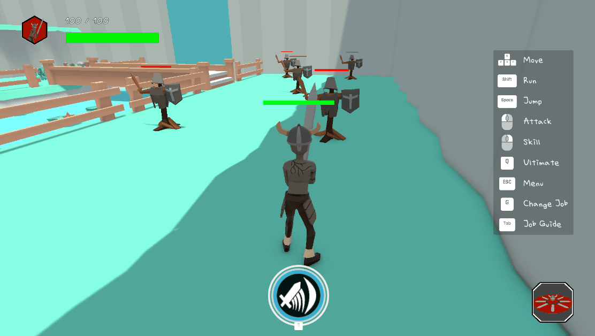
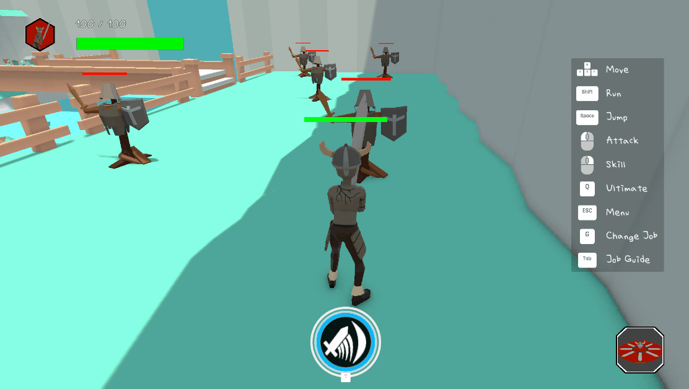

# Gameplay Combat

이 폴더는 바바리안의 기본 공격·궁극기 투사체와 사이클롭스의 서버 권위 타격 판정을 보여줍니다.

## 실행 화면

### 바바리안 스킬

### 바바리안 궁극기

### 사이클롭스 공격

## 처리 흐름

`Owner 입력 → ServerRpc 요청 → 서버 상태·쿨다운 검증 → 애니메이션 히트 윈도우 → 서버 충돌 판정 → NetworkObject별 중복 제거 → DamageContext 적용`

## 파일별 설명

### [`Barbarian/BarbarainAttack.cs`](Barbarian/BarbarainAttack.cs)

오너의 공격 요청을 서버에서 다시 검증하고, 공격 프로필의 사거리·레이어·최대 타격 수를 이용해 피해를 적용합니다. 한 히트 윈도우에서 같은 `NetworkObject`가 여러 Collider로 중복 피해를 받지 않도록 차단하고, 웨이브 경과 시간에 따른 패시브 피해와 궁극기 게이지를 서버에서 계산합니다.

### [`Barbarian/Ult/BarbarianUltimate.cs`](Barbarian/Ult/BarbarianUltimate.cs)

서버에서 생존 상태와 프리팹을 확인한 뒤 애니메이션 이벤트 시점에 풀링된 투사체를 생성하고, 서버에서 계산한 공격력·치명타 결과를 투사체에 전달합니다.

### [`Barbarian/Ult/BarbarianUltimateProjectile.cs`](Barbarian/Ult/BarbarianUltimateProjectile.cs)

서버가 `SphereCastNonAlloc`으로 충돌을 판정하고 대상별 한 번만 피해를 적용합니다. 소유자가 사라진 경우 추가 판정을 중단하며, 비주얼을 즉시 비활성화하고 SFX 잔향 시간을 확보한 뒤 네트워크 오브젝트를 풀로 반환합니다.

### [`Cyclops/CyclopsAttack.cs`](Cyclops/CyclopsAttack.cs)

애니메이션 이벤트로 서버 히트 윈도우를 열고, 공격 프로필에 따라 범위 내 대상을 찾습니다. 같은 네트워크 대상의 중복 타격과 아군 피해를 검사한 뒤 피해와 넉백을 서버에서 적용합니다.
