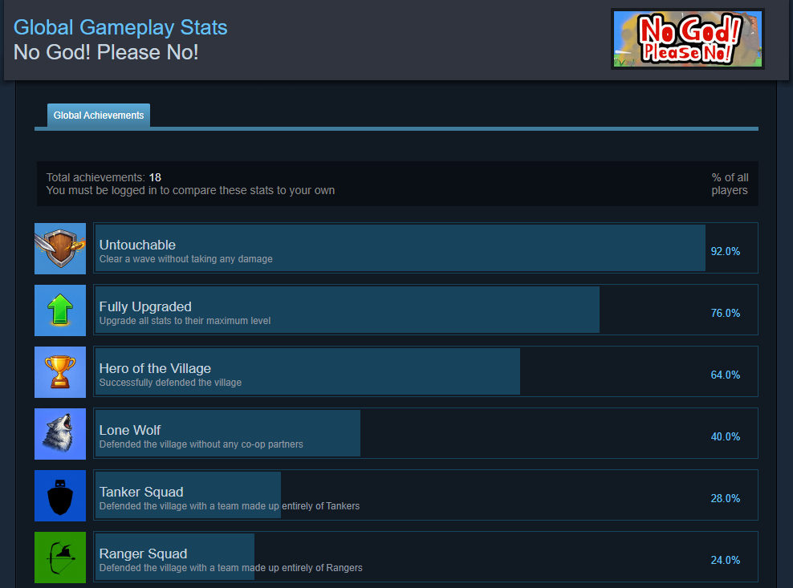

# Achievements

이 폴더는 게임 규칙을 플랫폼 API에서 분리하고, 서버에서 확인한 스킬 지표를 해당 플레이어의 Steam 업적 해금으로 연결하는 구조를 보여줍니다.

[Steam 커뮤니티에서 전체 도전과제 목록 보기](https://steamcommunity.com/stats/4179710/achievements)

## 처리 흐름

### 스킬 지표 업적

`서버 게임 로직 → Ability/Metric/Value 보고 → ScriptableObject 조건 조회 → 세션 중복 제거 → TargetRpc → 오너 클라이언트 → Steam 해금`

스킬의 처치 수·밀어낸 적 수·지속 시간 같은 값은 서버에서 보고합니다. `AchievementNetRelay`가 설정 데이터로 달성 여부를 판단하고, 조건을 만족한 플레이어의 오너 클라이언트에만 해금 요청을 전달합니다.

### 팀 구성 업적

`게임 시작 멤버·직업 스냅샷 → 네트워크 동기화 대기 → 승리 시점 멤버 집합 비교 → 단일 직업 유지 검증 → 해금`

팀 구성 업적은 동기화된 `PlayerRegistry`를 기준으로 시작과 승리 시점의 인원수·소유자 ID 집합·직업을 함께 비교합니다. 스폰 직후 직업 정보가 준비되지 않은 경우 다음 프레임에 다시 시도합니다.

## 파일별 설명

### [`IAchievements.cs`](IAchievements.cs) · [`AchievementManager.cs`](AchievementManager.cs)

게임 코드가 Steamworks.NET에 직접 의존하지 않도록 업적 조회·해금 API를 인터페이스로 분리합니다. `AchievementManager`는 플랫폼 구현에 호출을 위임하고, 능력별 지표를 `AbilityAchievementConfig`의 목표값과 비교합니다.

### [`AbilityAchievementConfig.cs`](AbilityAchievementConfig.cs)

`AbilityId`와 `AbilityMetric` 조합을 업적 키와 목표값에 연결하는 `ScriptableObject` 설정입니다. 런타임에는 튜플 키 딕셔너리를 구성해 조건을 조회합니다.

### [`AchievementNetRelay.cs`](AchievementNetRelay.cs)

서버에서 능력 지표를 검사하고 플레이어별 세션 중복 해금을 막은 뒤, `TargetRpc`로 해당 오너에게만 업적 키를 전달합니다. 실제 Steam API 호출은 오너 클라이언트에서 수행합니다.

### [`Condition/AchievementTracker.cs`](Condition/AchievementTracker.cs)

팀 구성 업적을 위해 시작 시점의 플레이어 집합과 직업을 저장하고, 승리 시점에 동일 멤버·동일 인원·동일 단일 직업 조건을 다시 확인합니다.

### [`Steam/SteamAchievements.cs`](Steam/SteamAchievements.cs)

Steam 사용자 통계가 준비된 뒤 업적 목록을 조회하고 해금을 처리합니다. Steam 이미지 데이터를 Unity `Sprite`로 변환해 캐시하고, 플랫폼의 이름·설명·숨김 여부·해금 시각을 공통 표시 데이터로 변환합니다.

### [`Steam/AchievementIdMapSteam.cs`](Steam/AchievementIdMapSteam.cs)

게임 내부 업적 키와 Steamworks에 등록한 API 이름을 분리하며, 누락된 매핑은 예외로 드러냅니다.
