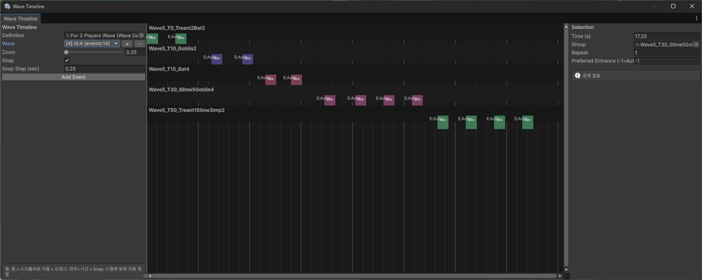

# Wave Timeline Editor

웨이브와 스폰 이벤트를 Inspector의 중첩 목록 대신 시간축에서 편집하기 위해 만든 Unity 에디터 도구입니다.

## 주요 기능

- 여러 웨이브의 선택·추가·삭제
- 스폰 이벤트의 시간축 배치와 드래그 이동
- 몬스터 그룹별 행 분리와 겹치는 이벤트의 자동 정렬
- 확대·축소, 가로·세로 스크롤, 시간 간격 Snap
- 선택한 이벤트의 그룹·반복 횟수·소환 위치 편집
- 이벤트 복제·삭제와 Unity Undo 지원
- 누락된 그룹, 잘못된 시간·반복 횟수, 과도한 집중 소환 검증

## 제작 목적

웨이브 데이터를 목록과 숫자만으로 편집할 때 발생하던 반복 작업을 줄이고, 특정 시간대의 소환 밀도와 이벤트 간 간격을 한눈에 확인할 수 있도록 제작했습니다. 이를 통해 레벨 디자인 수정과 데이터 오류 확인을 하나의 창에서 처리할 수 있습니다.
